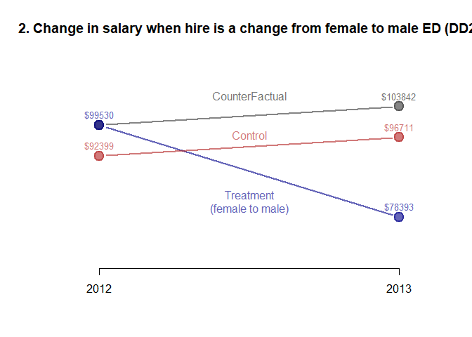
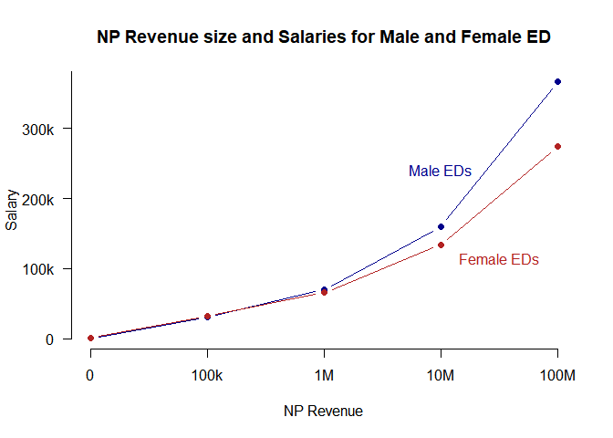

Regression Analysis for gender equality in salaries of Non-Profit Executive Directors (ED)
================
Ignacio Pezo Salazar

Introduction
------------

According to 2015 data from the Census Bureau ([link here](https://www.census.gov/content/dam/Census/library/publications/2016/demo/p60-256.pdf)), women earn 80% of what their male counterparts earn when comparing full-time, year-round workers. And although wage gap has reduced over the past decades, more recent efforts have seen a stall in progress ([link here](https://www.dol.gov/wb/media/gender_wage_gap.pdf)). In the non-profit (NP) sector gender gap is persistent: according to Nonforprofit Quarterly ([link here](https://nonprofitquarterly.org/2015/01/21/women-in-power-or-not-so-much-gender-in-the-nonprofit-sector/)), the richer the NP, the less gender equity found in its leadership. This report presents the main findings of a research project conducted to explore the current gender pay gap in the nonprofit sector.

About the dataset
-----------------

This study used NPs finance data collected from tax reports (From 990) and made electronically available to the public by the IRS. The data is from years 2012 and 2013 with variables of the NP like age, id, state, sector, executive director (ED) gender and salary, ED's average hours per week, and other relevant financial information. Private information was replaced. Although these data was used as control variables to adjust the comparisons and improve internal validity, some key information is missing in the dataset: the ED's profession, educational background, previous job experience, and the number of years in the present NP. There was unavailable data to account for these variables.

*General Descriptives of the Dataset*

``` r
stargazer(dat, type="text")
```

    ## 
    ## ===================================================================================
    ## Statistic           N         Mean          St. Dev.         Min          Max      
    ## -----------------------------------------------------------------------------------
    ## FILEREIN          68,214 454,373,178.000 266,437,875.000 10,024,645   996,012,377  
    ## NPAGE             65,428     28.942          18.522          -1           110      
    ## TAXYR             68,214    2,012.500         0.500         2,012        2,013     
    ## RULEDATE          65,548   198,098.800      8,683.202         0         201,404    
    ## REVENUE           65,548 12,737,572.000  89,781,390.000  -12,172,689 5,840,349,457 
    ## ASSETS            65,548 24,573,829.000  437,214,262.000 -6,295,553  72,763,619,000
    ## AVGHRS            68,214     39.328           9.260         1.150       168.000    
    ## SALARY            68,214   118,178.900     153,774.200        2        13,573,496  
    ## PROPORTION_FEMALE 68,135      0.496           0.486         0.000        1.000     
    ## M2012CEO          68,214      0.502           0.500           0            1       
    ## TREAT             68,214      0.018           0.134           0            1       
    ## POST              68,214      0.500           0.500           0            1       
    ## -----------------------------------------------------------------------------------

Regression Analysis
-------------------

Four different regression models where applied to the data:

1.  A OLS naive model of Salary onto Gender without any controls;
2.  Salary onto Gender while controlling for fixed effects and other variables (FE model);
3.  Difference in Difference comparison for the treatment of Gender change (DD model); and
4.  Salary regressed onto Gender and NP revenue, while taking into account the interaction between gender and revenue.

Each one of these models was chosen as a final result because they shed light into a particular dimension of the gender gap. The analysis and interpretation will be described in what follows.

### Model 1: OLS

Naive model of Salary onto Gender without any controls

``` r
ols <- lm( SALARY ~ GENDER , data=dat )

stargazer(ols, header = F, type = "text")
```

    ## 
    ## ================================================
    ##                         Dependent variable:     
    ##                     ----------------------------
    ##                                SALARY           
    ## ------------------------------------------------
    ## GENDERmale                 47,449.880***        
    ##                             (1,164.503)         
    ##                                                 
    ## Constant                   94,388.940***        
    ##                              (824.714)          
    ##                                                 
    ## ------------------------------------------------
    ## Observations                   68,135           
    ## R2                             0.024            
    ## Adjusted R2                    0.024            
    ## Residual Std. Error   151,982.600 (df = 68133)  
    ## F Statistic         1,660.308*** (df = 1; 68133)
    ## ================================================
    ## Note:                *p<0.1; **p<0.05; ***p<0.01

``` r
plot(y= log(dat$SALARY), x= as.factor(dat$GENDER))
```

 According to this analysis, male and women executive directors earn significantly different average salaries:

-   ED Female average salary: 94,388.94
-   ED Male average salary: 141,838.8 (47449.880 + 94388.940)

Model 2: Controlling for Fixed Effects
--------------------------------------

We will improve the first model by adding control variables to account for omitted variables including fixed effects for the state, and fixed effects for industry subsector (arts, education, health, etc.).

``` r
#Fixed effects for:
#STATE Location of the nonprofit
#NTMAJ12 Subsector of the nonprofit

#Control variables:
#NPAGE Nonprofit age                  
#REVENUE Total annual revenue for the nonprofit        
#ASSETS Total assets of the nonprofit     
#AVGHRS Average hours worked each week

#Assets and revenue variables are too large numbers. Putting them in terms of millions to make them more friendly to understand:
dat$REV.mll <- dat$REVENUE / 1000000
dat$ASS.mll <- dat$ASSETS / 1000000

#running regression
fe <- lm(SALARY ~  GENDER + NPAGE + AVGHRS + REV.mll + ASS.mll + factor(STATE) - 1 + factor(NTMAJ12) - 1, data=dat)

stargazer( ols, fe, type="text", 
           column.labels = c("OLS", "Fixed Effects"),
           omit.stat = c("adj.rsq", "f","ser"), 
           omit= c("STATE", "NTMAJ12"),            
           add.lines=list(c("Sate Fixed Effects?", "No","Yes")),
           digits=2)
```

    ## 
    ## ================================================
    ##                         Dependent variable:     
    ##                     ----------------------------
    ##                                SALARY           
    ##                          OLS       Fixed Effects
    ##                          (1)            (2)     
    ## ------------------------------------------------
    ## GENDERfemale                       -15,835.10** 
    ##                                     (7,124.54)  
    ##                                                 
    ## GENDERmale           47,449.88***   16,675.50** 
    ##                       (1,164.50)    (7,125.55)  
    ##                                                 
    ## NPAGE                                854.76***  
    ##                                       (27.29)   
    ##                                                 
    ## AVGHRS                              1,391.33*** 
    ##                                       (52.27)   
    ##                                                 
    ## REV.mll                              754.29***  
    ##                                       (7.15)    
    ##                                                 
    ## ASS.mll                              -35.40***  
    ##                                       (1.44)    
    ##                                                 
    ## Constant             94,388.94***               
    ##                        (824.71)                 
    ##                                                 
    ## ------------------------------------------------
    ## Sate Fixed Effects?       No            Yes     
    ## Observations            68,135        65,351    
    ## R2                       0.02          0.60     
    ## ================================================
    ## Note:                *p<0.1; **p<0.05; ***p<0.01

``` r
#difference between male and female
#16675.50 - - 15835.10 = 32510.6
```

Note: This table is omitting the coefficients for the fixed effects of State and Sector. These coefficients behave like constants when a subject belongs to a particular state or sector. For example, if a subject belongs to NY State and its NGO is on the Health sector, then these coefficients for the corresponding values would be included in the calculation of the price salary.

The FE model's coefficients show the isolated effect of being female (GENDERfemale) or male (GENDERmale) in your salary. After controlling for the fix effects of State and Sector.

One of the weaknesses of this model is that there is no control for the baseline prior to the treatment. Although the use of statistical methods is an attempt to account for omitted variable bias, the internal validity of the model is at stake without a randomized selection of the groups or a baseline observation. This is precisely the main weakness of a POST ONLY design like this one: there is no way to know whether the two compared groups had similar characteristics prior to the treatment. To address this issue, we conducted a DD design that is explained next.

*Which are the top 5 largest coefficients in this model?*

``` r
x <- coefficients(fe)
x <- data.frame(Coefficient = as.character(names(x)), Value = x, row.names = NULL)
head(arrange(x, desc(Value)), 5)
```

    ##         Coefficient     Value
    ## 1 factor(NTMAJ12)EH 241488.99
    ## 2 factor(NTMAJ12)BH 102335.23
    ## 3   factor(STATE)DC  69470.08
    ## 4   factor(STATE)MD  46489.11
    ## 5 factor(NTMAJ12)MU  41248.96

Model 3: Difference in Difference
---------------------------------

In a difference-in-difference design, the counterfactual is a calculated projection using the secular trend that is identified through the control group, which is a similar group that did not receive the treatment. This design is the closest one can get to an experimental design and, thus, has the benefit of improving the internal validity of the study because: (1) Controlling for secular trends which could otherwise lead to a Type I error (false positive); and (2) pre-post observation allows to hold the NP constant and therefore control for variables like local living costs, NP sector, NP size. Although average hours per week should remain constant despite treatment (it is the same position in the same organization), compared to the fixed effect regression, this design does not allow to control for events like maternity leave which would reduce the work hours of females and, thus, reduce their salary.

*Comparing the effect of a different gender when there is a change in ED*

1.  Change in salary when hire is a change from male to female (DD1)

-   Treatment group: male ED in 2012 & female ED in 2013
-   Control group: male ED in 2012 & male ED in 2013

1.  Change in salary when hire is a change from female to male (DD2)

-   Treatment group: female ED in 2012 & male ED in 2013
-   Control group: female ED in 2012 & female ED in 2013

``` r
#i) Change in salary when hiring a female

#Before/After dummy variable: POST (where 1 is for 2013 and 0 for 2012)
#Treatment/Control group variable: TREAT (where 1 is for change in gender, 0 no change of gender)

#Because the dataset has both dummy variables incorporated, I only need to subset by gender.
#In order to make this first DD design I need to keep all cases that in 2012 had a MALE ED

#subsetting those who had male in the PRE
x <- dat$POST == 0 & dat$GENDER == "male" 
x <- dat$FILEREIN[x] #getting the id of the NP I want
x <- dat$FILEREIN %in% x #creating a vector to subset them
fem <- dat[x,]

#creating an interaction variable
fem$interaction <- fem$TREAT * fem$POST

#running the regression
dd1 <- lm(SALARY ~ POST + TREAT + interaction, data = fem)


#ii) Change in salary when hiring a male

#subsetting those who had female in the PRE
x <- dat$POST == 0 & dat$GENDER == "female" 
x <- dat$FILEREIN[x] #getting the id of the NP I want
x <- dat$FILEREIN %in% x #creating a vector to subset them
male <- dat[x,]

#creating an interaction variable
male$interaction <- male$TREAT * male$POST

#running the regression
dd2 <- lm(SALARY ~ POST + TREAT + interaction, data = male)

#RESULTS
stargazer( dd1, dd2, type="text", 
           omit.stat = c("adj.rsq", "f","ser"), 
           digits=2)
```

    ## 
    ## =========================================
    ##                  Dependent variable:     
    ##              ----------------------------
    ##                         SALARY           
    ##                   (1)            (2)     
    ## -----------------------------------------
    ## POST            3,166.18     4,312.10*** 
    ##                (2,103.95)    (1,027.61)  
    ##                                          
    ## TREAT        -29,563.51***    7,131.74   
    ##               (10,515.44)    (5,646.93)  
    ##                                          
    ## interaction  -41,357.21***  -25,449.74***
    ##               (14,871.08)    (7,985.97)  
    ##                                          
    ## Constant     141,089.10***  92,399.49*** 
    ##                (1,487.71)     (726.63)   
    ##                                          
    ## -----------------------------------------
    ## Observations     34,272        33,942    
    ## R2               0.002          0.001    
    ## =========================================
    ## Note:         *p<0.1; **p<0.05; ***p<0.01

This analysis can be visualized to make it more easy to understand:

``` r
#i) Change in salary when hiring a female

options(scipen=5)
time <- 1:2
trt <- c(141089-29563, 141089-29563+3166-41357)
con <- c(141089, 141089 + 3166)
cf <- c(141089-29563, 141089-29563+3166)

plot(x = time, y= cf, ylab="", xlab="", type="b", bty="n", pch=19,main="1. Change in salary when hire is a change from male to female ED (DD1)", xaxt = "n", yaxt="n", col=adjustcolor("grey20", alpha.f = .6), cex = 2, lwd = 2, ylim=c(min(rbind(trt, con, cf)) - 10000,max(rbind(trt, con, cf))+ 10000), xlim = c(.9, 2.1))

points(x = time, y= trt, type="b", pch=19, col=adjustcolor("darkblue", alpha.f = .6), cex = 2, lwd = 2 )
points(x = time, y= con, type="b", pch=19, col=adjustcolor("firebrick", alpha.f = .6), cex = 2, lwd = 2 )
axis(1, at=1:2, labels= c("2012", "2013"))

text(time, trt, paste("$",trt,sep=""), cex = .8, pos=3, col=adjustcolor("darkblue", alpha.f = .6))
text(time, con, paste("$",con,sep=""), cex = .8, pos=3, col=adjustcolor("firebrick", alpha.f = .6))
text(2, cf[2], paste("$",cf[2],sep=""), cex = .8, pos=3, col=adjustcolor("grey10", alpha.f = .6))
text(1.5, cf[2], "CounterFactual", cex = 1, pos=3, col=adjustcolor("grey10", alpha.f = .6))
text(1.5, trt[2]-7000, "Treatment\n(male to female)", cex = 1, pos=3, col=adjustcolor("darkblue", alpha.f = .6))
text(1.5, con[2], "Control", cex = 1, pos=3, col=adjustcolor("firebrick", alpha.f = .6))
```


``` r
#ii) Change in salary when hiring a male

options(scipen=5)
time <- 1:2
trt <- c(92399+7131, 92399+7131+4312-25449)
con <- c(92399, 92399 + 4312)
cf <- c(92399+7131, 92399+7131+4312)

plot(x = time, y= cf, ylab="", xlab="", type="b", bty="n", pch=19,main="2. Change in salary when hire is a change from female to male ED (DD2)", xaxt = "n", yaxt="n", col=adjustcolor("grey20", alpha.f = .6), cex = 2, lwd = 2, ylim=c(min(rbind(trt, con, cf)) - 10000,max(rbind(trt, con, cf))+ 10000), xlim = c(.9, 2.1))

points(x = time, y= trt, type="b", pch=19, col=adjustcolor("darkblue", alpha.f = .6), cex = 2, lwd = 2 )
points(x = time, y= con, type="b", pch=19, col=adjustcolor("firebrick", alpha.f = .6), cex = 2, lwd = 2 )
axis(1, at=1:2, labels= c("2012", "2013"))

text(time, trt, paste("$",trt,sep=""), cex = .8, pos=3, col=adjustcolor("darkblue", alpha.f = .6))
text(time, con, paste("$",con,sep=""), cex = .8, pos=3, col=adjustcolor("firebrick", alpha.f = .6))
text(2, cf[2], paste("$",cf[2],sep=""), cex = .8, pos=3, col=adjustcolor("grey10", alpha.f = .6))
text(1.5, cf[2], "CounterFactual", cex = 1, pos=3, col=adjustcolor("grey10", alpha.f = .6))
text(1.5, trt[2]-500, "Treatment\n(female to male)", cex = 1, pos=3, col=adjustcolor("darkblue", alpha.f = .6))
text(1.5, con[2]-2000, "Control", cex = 1, pos=3, col=adjustcolor("firebrick", alpha.f = .6))
```



*DD1 (male to female)*

In the first design, there is a statistically significant difference (-29,563.51\*\*\*) between the control group and the treatment group, before treatment. The control group has an average ED salary of $141,089.10, while the treatment group has an average of $111,525.6.

After a year, the control group (male -&gt; male) has an increase of $3,166.18 in the average salary, however, this coefficient has no statistical significance, which means we have to disregard this effect and there is no statistically significant secular trend.

On the other hand, the difference in difference coefficient shows a negative change of $41,357.21 in the salary of the new ED. This means that the change from male -&gt; female has a negative effect on salary.

*DD2 (female to male)*

In the second design, there is no statistically significant difference (7,131.74) between the control group and the treatment group, before treatment. These means both groups start at similar conditions with an approximate average ED salary of $92,399.49.

After a year, the control group (female -&gt; female) has an increase of $4,312.10 in the average salary, which is statistically significant. This is the secular trend.

The difference in difference coefficient shows a negative change of $25,449.74 in the average salary of the new ED. This means that the change from female -&gt; male has a negative effect on salary too.

From the comparison of the two designs, we can say that a change of ED for a NP means a decrease in salary and that if the change is from male -&gt; female that decrease is larger (41,357.21) than if it is from female -&gt; male (25,449.74).

This evidence could be used to argue that new female EDs when replacing an ED of the opposite gender are paid 38% less than their male counterparts.

*Overall*

The Comparison shows evidence that there is a secular trend of increase in salary after one year for both genders, which can be accounted for a regular raise in pay after a year extra of work in the same NP. However, the model predicts that any NP that changes ED will see a reduction on the salary of that position. This can be explained because new ED do not have the compensations that build up with years of compromise to the same NP. Although both groups show a decrease, the gender gap remains because, after controlling for secular trends, the decrease for a female replacing a male is larger (`$`41,357) than a male replacing a female (`$`25,449). This evidence could be used to argue that new female EDs when replacing an ED of the opposite gender are paid 38% less than their male counterparts, when controlling for other variables.

One weakness of this design is that the comparison provides information about the size of a change between two time periods but does not provide a slope that can be us to predict levels of the effect. An issue remains about the origin of the sample. We do not have information about how the assignment to control and treatment groups was made and, therefore, we rely in the following assumptions: (1) that NPs of treatment and control groups have the same salary change sensitivity to the independent variables (and therefore have Parallel Trends in outcome); (2) That the allocation of the treatment (gender change in ED) was not determined by any characteristic specific to the groups.

Model 4:
--------

This model answers a different question: "Do large nonprofits pay female s more or less equitably than small nonprofits?"

In order to have a model that allows the relationship between REVENUE and SALARY to vary by GENDER, we will include a regression of the interaction between REVENUE and GENDER. This model follows a post only design, but has the virtue of pondering the interaction between NP size and gender.

To answer this, I will only work with data from 2012. This is to prevent over representing NPs (in 2012 and 2013) and also removing the bias that a change in ED gender could produce (only present in the 2013 data).

Because of the large variance of the variables, I will use logs in order to make results more intuitive.

``` r
#subsetting the data to only 2012
x <- dat$POST == 0
dat12 <- dat[x,]

#adding gender to the model
m1 <- lm(log(SALARY+1) ~ log(REVENUE+1) + GENDER + log(REVENUE+1):GENDER, data = dat12)
```

    ## Warning in log(REVENUE + 1): NaNs produced

``` r
stargazer( m1, type="text", 
           omit.stat = c("adj.rsq", "f","ser"), 
           digits=2)
```

    ## 
    ## =======================================================
    ##                                 Dependent variable:    
    ##                             ---------------------------
    ##                                   log(SALARY + 1)      
    ## -------------------------------------------------------
    ## log(REVENUE + 1)                      0.31***          
    ##                                       (0.003)          
    ##                                                        
    ## GENDERmale                           -0.63***          
    ##                                       (0.06)           
    ##                                                        
    ## log(REVENUE + 1):GENDERmale           0.05***          
    ##                                       (0.004)          
    ##                                                        
    ## Constant                              6.81***          
    ##                                       (0.05)           
    ##                                                        
    ## -------------------------------------------------------
    ## Observations                          32,779           
    ## R2                                     0.43            
    ## =======================================================
    ## Note:                       *p<0.1; **p<0.05; ***p<0.01

All coefficients are statistically significant. The constant (B0), would be the amount of Salary a female ED will earn when the NP's revenue is 0. The GENDERmale coefficient (B3) determines the difference between a female ED and a male at 0 NP revenue. The log(REVENUE+1) coefficient (B1) is the "slope" of percent increase in salary to one percent increase in NP revenue for a female. The interaction coefficient log(REVENUE+1):GENDERmale (B4) accounts for the difference in the "slope" of percent increase in salary to one percent increase in NP revenue for a male as compared to females.

In the following code chunk, calculations are made to transform logs back to normal values. This will be used for a plot.

``` r
#when revenue = 0
#male
exp((6.81 - 0.63) + (0.31+ 0.05)*0)= 482.992

#female
exp((6.81) + (0.31)*0)= 906.8708

482.992 - 906.8708 = -423.8788

423.8788/482.992*100

482.992 * 1.87761

#Small, male 100k
exp((6.81 - 0.63) + (0.31+ 0.05)*log(100000))= 30474.73

#small female
exp((6.81) + (0.31)*log(100000))= 32176.99

30474.73 - 32176.99 = -1702.26

#big male 1million
exp((6.81 - 0.63) + (0.31+ 0.05)*log(1000000))= 69813.58

#big female
exp((6.81) + (0.31)*log(1000000))= 65696.98

69813.58 - 65696.98 = 4116.6

#extra big male 10 million
exp((6.81 - 0.63) + (0.31+ 0.05)*log(10000000))=  159933.7

#extra big female
exp((6.81) + (0.31)*log(10000000))=  134136

159933.7 - 134136 = 25797.7

#superextra big male billion
exp((6.81 - 0.63) + (0.31+ 0.05)*log(100000000))=  366386.9

#superextra big female
exp((6.81) + (0.31)*log(100000000))=  273870.6

366386.9 - 273870.6 = 92516.3
```

Plotting the differences:

``` r
#plotting salaries
options(scipen=5)
salaries <- data.frame(Size = c("0", "100k", "1M", "10M", "100M"), Male = c(482.992, 30475,69814,159934,366387), Female = c(907,32177,65697,134136,273871), stringsAsFactors = F)
plot(x = 1:5, y= salaries$Male, ylab="Salary", xlab="NP Revenue", type="b", bty="n", pch=19,main="NP Revenue size and Salaries for Male and Female ED", xaxt = "n", yaxt="n", col="darkblue")
points(x = 1:5, y= salaries$Female, type="b", pch=19, col="firebrick")

axis(1, at=1:5, labels= salaries$Size)
axis(2, at=c(0,100000,200000,300000,400000), labels= c("0", "100k", "200k", "300k", "400k"), las=2)
text(4, salaries$Male[4]+60000, "Male EDs", cex = 1, pos=3, col=adjustcolor("darkblue", alpha.f = 1))
text(4.5, salaries$Female[4], "Female EDs", cex = 1, pos=1, col=adjustcolor("firebrick", alpha.f = 1))
```



Results show that at zero revenue levels, female EDs are earning 87% more than their male counterparts. However, as the NP size increases our model predicts that male EDs start earning more than their female counterparts. This difference happens at a constant rate, and therefore the distance becomes greater the larger the NP revenue, which means a less equitable condition for women.

Conclusion
----------

The FE model shows that there is a statistically significant difference between male and female ED in the NP sector. The DD design showed that this gender gap is also present when NPs replace their ED with a different gender. Finally, our third interaction model shows that the gender gap increases when the size of the non for profit increases. All three models show a statistically persistent gender gap in the NP sector. Overall, additional data is needed to control variables like ED's profession, educational background, previous job experience, and the number of years in the present NP.
